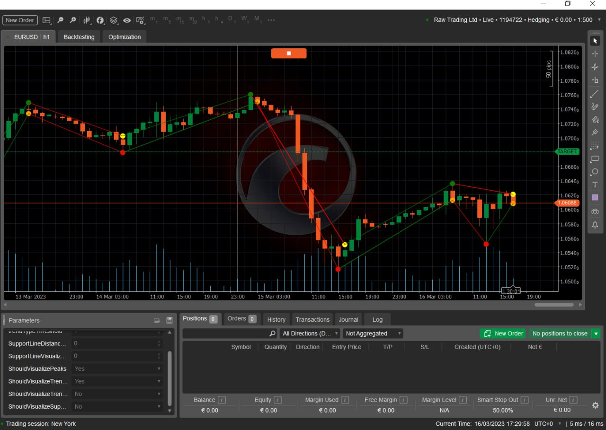
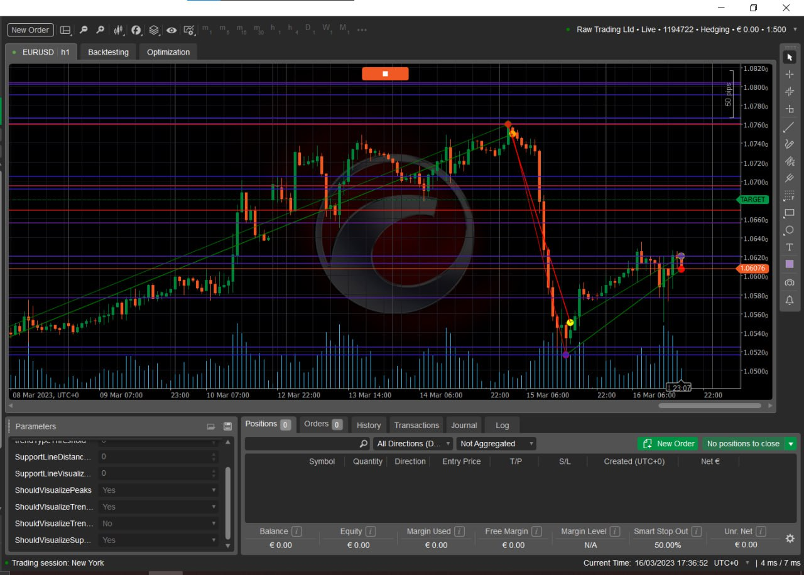

# A CTrader forex indicator to visualise price momentum influences
The indicator identifies and visualises trendlines, support levels, peaks and resistance levels in a price of an asset through technical analysis.
The significance of each line or element is evaluated based on how recent it is and on whether it stemmed from a major price movement. All elements can be combined to predict influences on future price momentum and used by other trading algorithms.

